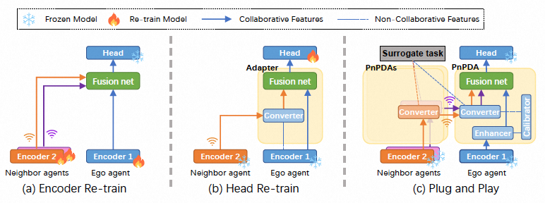

# Plug and Play: A Representation Enhanced Domain Adapter for Collaborative Perception [ECCV 2024]

This is the official implementation of ECCV2024 paper "Plug and Play: A Representation Enhanced Domain Adapter for Collaborative Perception". Tianyou Luo, Quan Yuan, Guiyang Luo, Yuchen Xia, Yujia Yang, Jinglin Li.


## Installation
This repo is mainly based on the cooperative detection framework [OpenCOOD](https://github.com/DerrickXuNu/OpenCOOD). Therefore, the installations are the same.
```bash
# Clone repo
git clone https://github.com/luotianyou349/PnPDA.git

cd PnPDA

# Setup conda environment
conda create -y --name pnpda python=3.7

conda activate pnpda
# pytorch >= 1.8.1, newest version can work well
conda install pytorch==1.12.1 torchvision==0.13.1 cudatoolkit=11.6 -c pytorch -c conda-forge
# spconv 2.0 install, choose the correct cuda version for you
pip install spconv-cu116

# Install dependencies
pip install -r requirements.txt
# Install bbx nms calculation cuda version
python opencood/utils/setup.py build_ext --inplace

# install opencood into the environment
python setup.py develop
```
## Data
### Download
The V2XSet data can be found from [google url](https://drive.google.com/drive/folders/1r5sPiBEvo8Xby-nMaWUTnJIPK6WhY1B6?usp=sharing). Since the data for train/validate/test is very large, we split each data set into small chunks, which can be found in the directory ending with _chunks, such as train_chunks. After downloading, please run the following command to each set to merge those chunks together:
```bash
cat train.zip.parta* > train.zip
unzip train.zip
```

### Structure
After downloading is finished, please make the file structured as following:
```bash
PnPDA # root of your v2xvit
├── v2xset # the downloaded v2xset data
│   ├── train
│   ├── validate
│   ├── test
├── opencood # the core codebase
```
### Details
Our data label format is very similar with the one in [OPV2V](https://github.com/DerrickXuNu/OpenCOOD).

## Getting Started
### Step1. Train Encoders and Heads
We will first train the agent's encoder and detection head in a homogeneous scenario, so you can use early fusion or feature fusion training. The training process can refer to the [OpenCOOD](https://github.com/DerrickXuNu/OpenCOOD) process.
```bash
python opencood/tools/train.py --hypes_yaml ${CONFIG_FILE} [--model_dir  ${CHECKPOINT_FOLDER} --half]
```
**Arguments Explanation:**
* hypes_yaml: the path of the training configuration file, e.g. opencood/hypes_yaml/point_pillar_v2xvit.yaml, meaning you want to train.
* model_dir (optional) : the path of the checkpoints. This is used to fine-tune the trained models. When the model_dir is given, the trainer will discard the hypes_yaml and load the config.yaml in the checkpoint folder.
* half(optional): if specified, hybrid-precision training will be used to save memory occupation.

After training, you can find the trained model in <kbd>opencood/logs</kbd>, which includes the encoder and detection head. You need to copy the model to <kbd>opencood/pre_train_modules</kbd>.
```bash
mkdir opencood/pre_train_modules
cp opencood/logs/your_model/last.pth opencood/pre_train_modules
mv opencood/pre_train_modules/last.pth opencood/pre_train_modules/new_model_name.pth
```
### Step2. Pre-train 
Before pre-training, you need to select the correct configuration file, like <kbd>opencood/hypes_yaml/aa_bb_ssl.yaml</kbd>. <kbd>aa</kbd> is the encoder model of ego agent, and <kbd>bb</kbd> is the encoder model of the neighboring agent.
Secondly, you need to modify several places in the configuration file:
1. Modify <kbd>root_dir</kbd> and <kbd>validate_dir</kbd> to the path of your database.
2. Modify <kbd>model/encoder_q/saved_pth</kbd> and <kbd>model/encoder_k/saved_pth</kbd> to the path of your trained model, usually: <kbd>opencood/pre_train_modules/xxx.pth</kbd>

> Please make sure that saved_pth and the model name correspond

Then execute the following command to start training:
```bash
python opencood/tools/train.py --hypes_yaml ${CONFIG_FILE} [--model_dir  ${CHECKPOINT_FOLDER} --half]
```
After training, similar to step 1, copy the trained model to <kbd>opencood/pre_train_modules</kbd>. At this point, you get the adapter.
### Step3. Finetuning
Please select <kbd>opencood/hypes_yaml/aa_bb_cpm_dd.yaml</kbd> similar configuration file for fine-tuning, where <kbd>aa</kbd> is the encoder model of ego agent, <kbd>bb</kbd> is the encoder model of the neighbor agent, and dd is the algorithm for feature fusion.

Specially, <kbd>opencood/hypes_yaml/aa_bb_cc_cpm_dd.yaml</kbd>, <kbd>aa</kbd> is the encoder model of ego agent, <kbd>bb</kbd> is the standard encoder model, <kbd>cc</kbd> is the encoder model of the neighbor agent, and <kbd>dd</kbd> is the algorithm for feature fusion. You will use this file when conducting backward compatibility experiments.
Please note that we have written different configuration files for different feature fusion algorithms.

Secondly, you need to modify several places in the configuration file:
1. Modify <kbd>root_dir</kbd> and <kbd>validate_dir</kbd> to the path of your database.
2. Modify <kbd>model/encoder_q/saved_pth</kbd> and <kbd>model/encoder_k/saved_pth</kbd> to the path of your trained encoders, usually: <kbd>opencood/pre_train_modules/xxx.pth</kbd>
3. Modify <kbd>model/pre_train_modules</kbd> to the path of your pre-trained adapter.
4. In the backward compatibility experiment, please modify <kbd>model/args/nig2base</kbd> and <kbd>model/args/base2ego</kbd> to the corresponding adapters.

> Please make sure that saved_pth and the model name correspond.

Then execute the following command to start training:
```bash
python opencood/tools/train.py --hypes_yaml ${CONFIG_FILE} [--model_dir  ${CHECKPOINT_FOLDER} --half]
```
### Step4. Validate
Execute the following command to start inference:
```bash
python opencood/tools/inference.py --model_dir ${CHECKPOINT_FOLDER}
```
## Acknowledgement
PnPDA is build upon [OpenCOOD](https://github.com/DerrickXuNu/OpenCOOD), which is the first Open Cooperative Detection framework for autonomous driving.

V2XSet is collected using [OpenCDA](https://github.com/ucla-mobility/OpenCDA), which is the first open co-simulation-based research/engineering framework integrated with prototype cooperative driving automation pipelines as well as regular automated driving components (e.g., perception, localization, planning, control).
